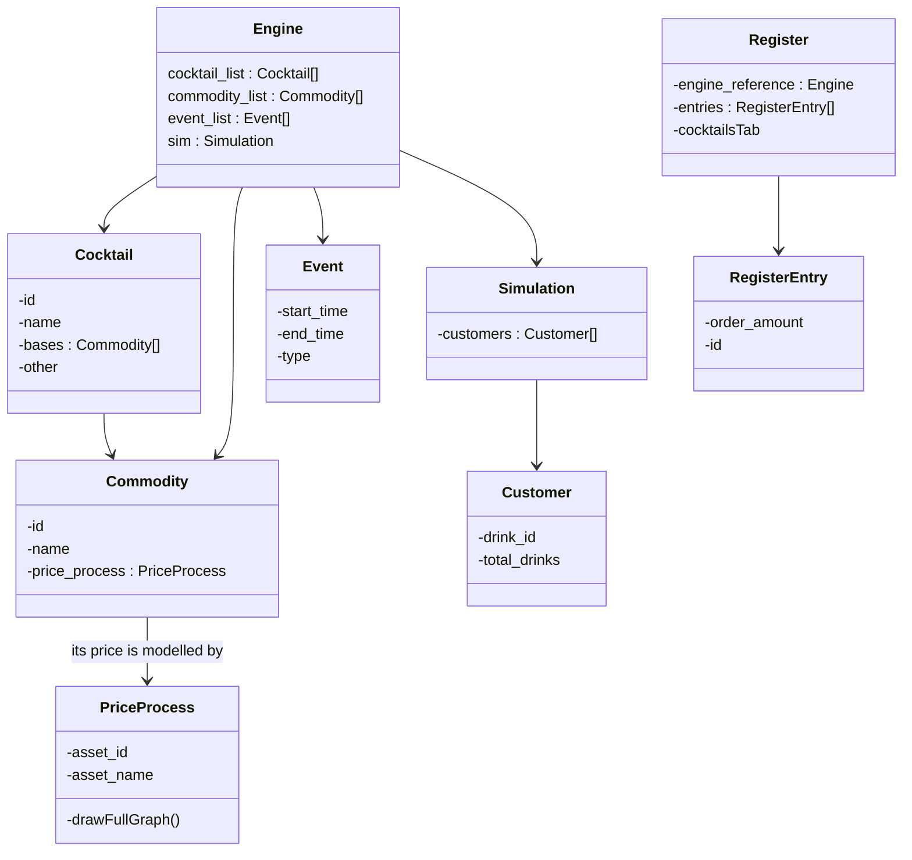

# Cocktail_price_simulation

Building a simulation framework where we test how a _dynamic price_ for a beverage in a bar can be implemented. 

I'm modelling the customer's thirst for drinks with a **Poisson process** $N_t (\lambda)$ with $\lambda$ indicating the drinks-per-hour.

TODO:
--> add links to cash registers in the _evolve_ function of the _Engine_ class.

## Class Interdependence Diagram

