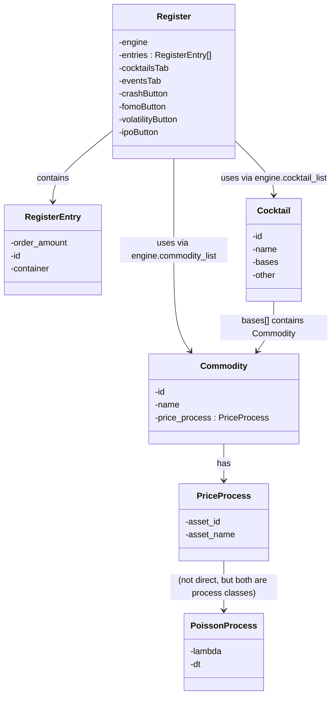

# Cocktail_price_simulation

Building a simulation framework where we test how a _dynamic price_ for a beverage in a bar can be implemented. 

I'm modelling the customer's thirst for drinks with a **Poisson process** $N_t (\lambda)$ with $\lambda$ indicating the drinks-per-hour.

Lots still TODO but looks interesting...

## Class Interdependence Diagram

